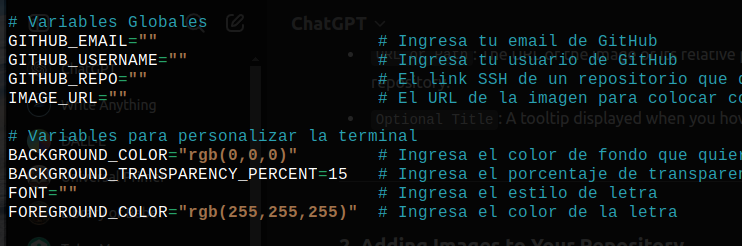

# Jarvis


Jarvis es un asistente de la terminal cuyo propósito es evitar procesos 
repetitivos en los computadores de Campuslands.

## Funcionalidades

- Limpiar archivos que dejaron anteriores usarios en el computador.
- Elegir automaticamente un navegador como predeterminado, basado en la elección previa del usuario.
- Sincronizar GitHub mediante una llave SSH.
- Mejorar la estética de la terminal.
- Cambiar el fondo del computador.
- Descargar e iniciar la aplicación Obsidian (*util para hacer apuntes en archivos Markdown*).
- Limpiar automaticamente todos los archivos, sesiones y todo rastro del usuario. 
- Apagar automaticante el computador.

### ¿Cómo se usa?

- Al descargar Jarvis verás en las primeras lineas del codigo variables globales

La idea es que llenes estas variables con la información que piden, así Jarvis se adaptará a tu gusto.
- Darle permisos de ejecución a Jarvis mediante el comando ```chmod +x jarvis```
- Jarvis tiene **3 protocolos**:

1. ***Protocolo de bienvenida***

    Lo activas mediante ```./jarvis.sh hello```
    Este protocolo se encarga de:
        
       - Limpia la carpeta de descargas.
       - Coloca el fondo que elegiste (*funcionalidad aún en desarrollo*)
       - Personaliza la terminal.
       - Limpia VS Code, así no apareceran extensiones y/o comandos predefinidos de usarios anteriores.
       - Coloca como navegador predeterminado a Google Chrome.
       - Modifica el archivo ```~/.gitconfig``` con tus datos. 
       - Conecta mediante una llave SSH el computador con tu cuenta de GitHub, para poder usar Git sin tener que ingresar tu contraseña en cada push.


2. ***Protocolo Obsidian*** 

    Lo activas mediante ```./jarvis obsidian```
    Este protocolo se encarga de:

       - Descargar la aplicación Obsidian y abrirla automáticamente.


3. ***Protocolo de despedida***

    Lo activas mediante ```./jarvis bye```
    Este protocolo se encarga de:

       - Elimina la llave SSH que se vinculó en el protocolo de bienvenida.
       - Cierra sesión en tu cuenta de VS Code.
       - Cierra sesión y elimina todo rastro tuyo en los navegadores Firefox y Chrome.
       - Elimina todo archivo de la carpeta de Descargas.
       - Elimina toda tu información del archivo ```~/.gitconfig```
       - Elimina el historial de comandos de la terminal.
       - Programa el computador para apagarse en 10 segundos.
       - Jarvis se autodestruye. 
